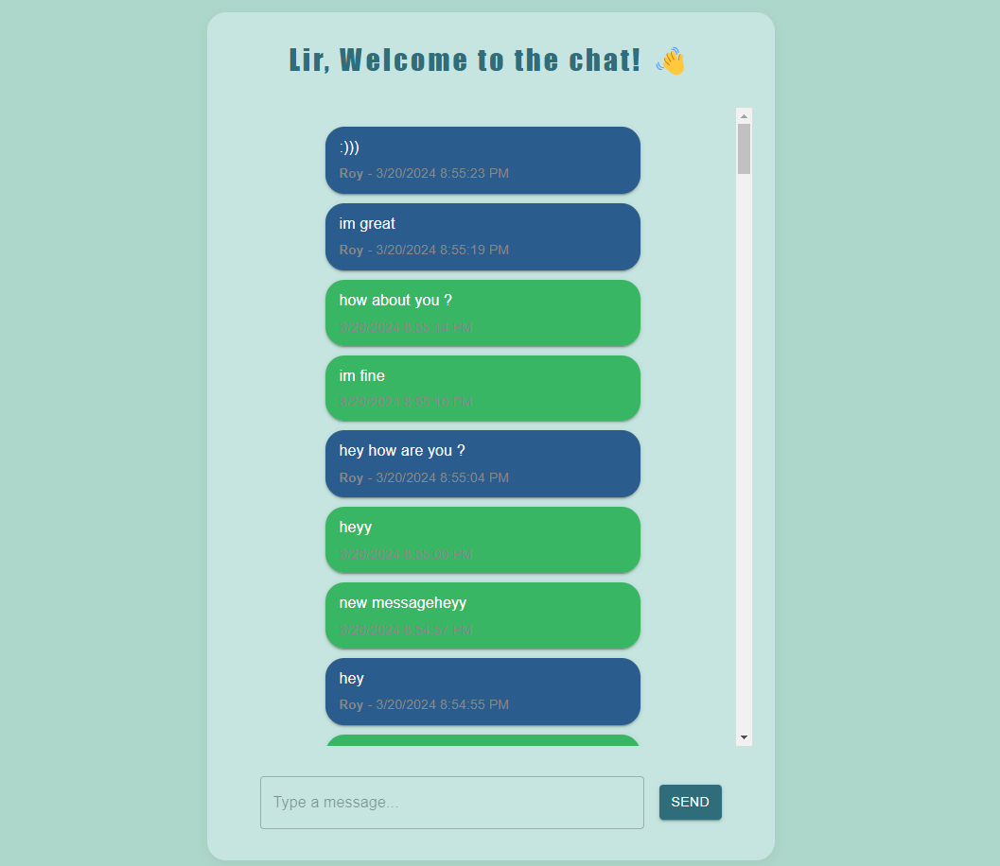
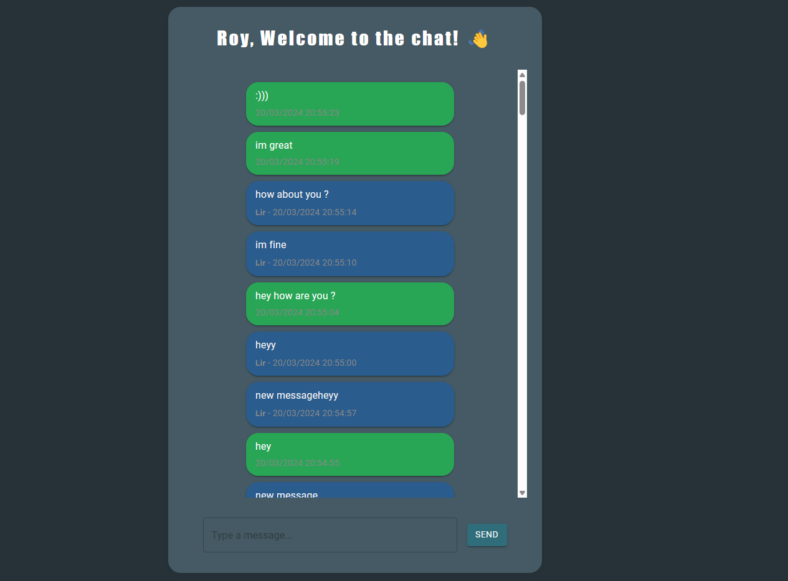

# Chat App Frontend

This is the frontend application for the Chat App project. It's built using TypeScript, Vite, Node.js, PostgreSQL, React, hooks, SCSS, and Material-UI.

## Table of Contents

- [Introduction](#introduction)
- [Features](#features)
- [Setup](#setup)
- [Usage](#usage)
- [Dependencies](#dependencies)
- [License](#license)

## Introduction

The Chat App Frontend provides the user interface for a real-time chat application. It allows users to send and receive messages, view message history, and interact with other users in real-time.

## Features

- Real-time messaging using Socket.IO
- User authentication
- Message display with Material-UI components
- Integration with the backend server for message storage and retrieval

## Setup

1. Clone the repository:

   ```bash
   git clone https://github.com/liralgazi/chat-app.git
   
2. Install dependencies:
   ```bash
   cd chat-app
   npm install
   ```
3. Set up environment variables:
Create a .env file in the root directory and add any necessary environment variables.

4. Run the development server:
   ```bash
   npm run dev
   ```
5. Build the production version:
   ```bash
   npm run build
   ```

## Usage 
Once the development server is running, open your browser and navigate to the specified URL (http://localhost:5173) to access the Chat App frontend. Ensure that the backend server is also running to enable full functionality.

## Dependencies
- [React: JavaScript library for building user interfaces]
- [React Router DOM: Declarative routing for React]
- [Material-UI: React components for faster and easier web development]
- [Socket.IO Client: Real-time bidirectional event-based communication library]
- [dotenv: Loads environment variables from a .env file]
- [cors: Middleware for handling Cross-Origin Resource Sharing (CORS)]

## License
This project is licensed under the ISC License.

## Screenshots
### lightmode:


### darkmode: 


### desktop notification:


